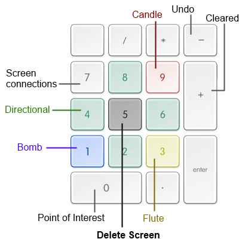

# ZMapper
A general purpose tracker for Legend of Zelda. Suitable for randomizers.

This is still a work in progress.

# Input
ZMapper lets you place and remove various markers indicating which screens 
you've visited, what secrets you've checked for, and more. ZMapper uses global 
hotkeys so that you don't need to switch between programs if playing in an 
emulator. Currently, inputs are hardcoded and use the number pad.

## Keyboard Input

* **Directional** - Move the cursor on the map. If the cursor moves onto an unvisited spot, it will be marked visited.
* **Bomb** - Toggle bomb marker for bombable caves and dungeon walls. In dungeons, press this key followed by a directional to mark a wall which can not be bombed through.
* **Candle** - Toggle candle marker for burnable bushes.
* **Flute** - Toggle the recorder marker for secrets revealed by the recorder. 
* **Screen connections** - Press this key followed by a directional to toggle screen connections. Draw borders around screens in the overworld, and draw connections between rooms in dungeons.
* **Point of Interest** - Mark a screen as a point of interest.
* **Cleared** - Mark a screen as cleared. In the overworld, a cleared screen will not show any other markers (bomb, flute, or candle), but you can press this key again to unclear the screen and restore the markers.
* **Undo** - Undoes the last change made. This does not include revealing/hiding screens.
* **Delete Screen** - Marks a screen as unvisited. Note that the state of markers and screen connections is preserved and will be restored when the screen is marked as visited again.

## Mouse Input
Mouse input is very simple and limited.

Item Icons:
* Left click - Mark an item obtained. For progressive items (e.g. Sword, White Sword, Magic Sword) each successive click advances to the next item level.
* Right click - Mark an item unobtained. For progressive items, each successive click reverts the item to the previous level.

Map:
* Left click - Place the cursor on a screen and mark it visited.
* Right click - Mark a screen as unvisited. Note that the state of markers and screen connections is preserved and will be restored when the screen is marked as visited again.
